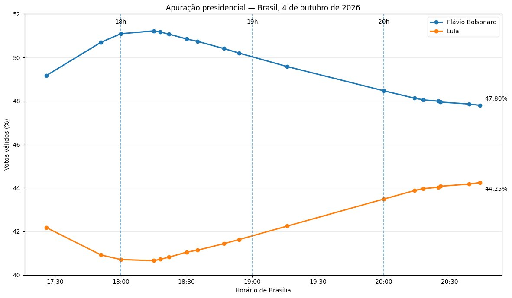
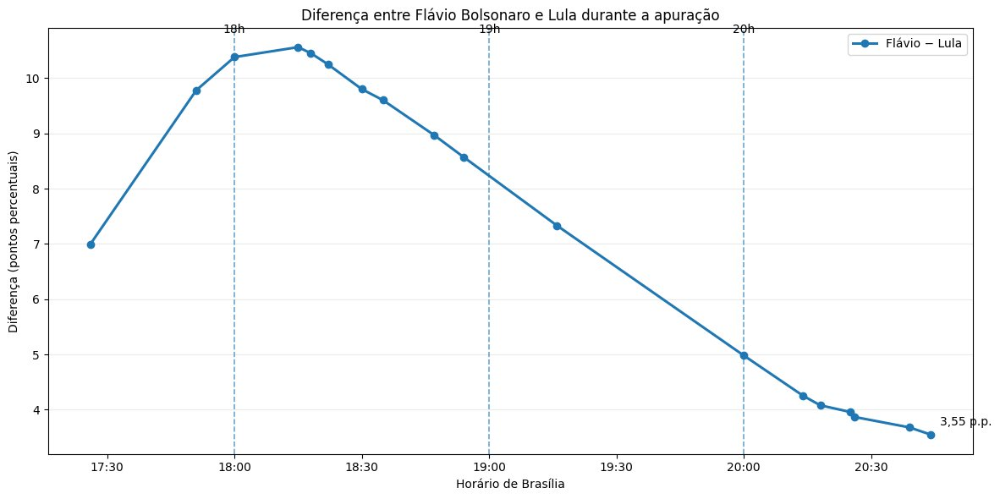
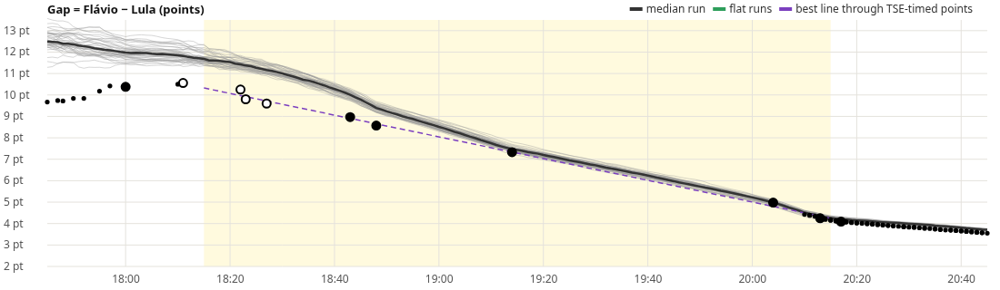
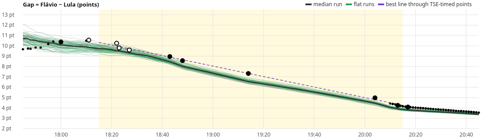
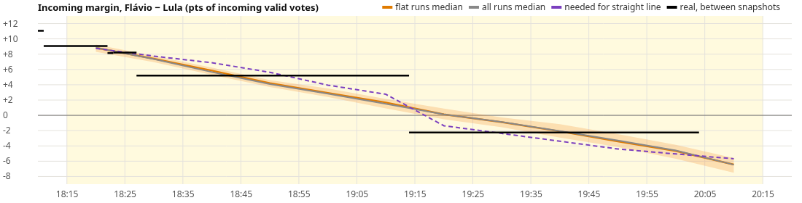

# Ballot Gap Lab

**Live page:** [https://fygarcia.github.io/brazil-ballot-gap-2026/](https://fygarcia.github.io/brazil-ballot-gap-2026/)

## TL;DR

**Question.** How hard is it for Brazil’s real ballot-transmission process to produce the near-straight decline in the Flávio − Lula gap seen between 18:15 and 20:15 (Brasília) on 4 Oct 2026?

**Answer (proportionate).** Not hard enough to treat that shape as evidence of manipulation — and not hard enough to prove the opposite either.

- Under a realistic arrival model (2022 TSE reception order applied to 2026 municipal results, paced to the 2026 count), **late-arriving Northeast/North votes alone produce most of the observed decline**.
- A straight-*looking* line **only at the sparse TSE-timed published points** is common (tens of percent of Monte Carlo runs, e.g. **75%** with within-state mix 0.5).
- A **strictly straight dense minute series** (max deviation ≤ 0.3 pt over 18:15–20:15) is uncommon under the baseline order (**0.2%**) but rises sharply when unknown within-state ordering is allowed (**40.4%** at mix 0.5). So “how hard” depends on what one means by “straight,” and on unknowns the 2026 boletim file would settle.
- Observed incoming margins between absolute snapshots (Flávio +8 to +11 early, then +5, then Lula +2) match the regional-arrival mechanism.
- The reference charts’ end labels (**47.80% / 44.25%**, gap **3.55** p.p. near 20:45) are a **partial**, not the final. The **TSE final** is Flávio **56,104,503** / Lula **53,879,538** of **119,300,788** valid (**47.03% / 45.16%**, gap **1.87** pt). After 20:45 the gap kept falling ~1.7 pt to that final.

This analysis **cannot certify the count**. The decisive check is the **2026 boletim reception-time file / BU-level audit** when TSE publishes it.

Neutral framing throughout: measure the shape; do not assume the count was clean or rigged.

---

## 1. The question, and why a straight line is non-trivial

Let $F(t)$, $L(t)$, $V(t)$ be cumulative Flávio, Lula, and valid votes at Brasília time $t$, and define the gap

$$
G(t)=\frac{F(t)-L(t)}{V(t)}.
$$

If votes arrive at rate $V'(t)$ with instantaneous incoming margin $m(t)=(F'-L')/V'$, differentiation gives

$$
\frac{dG}{dt}=(m-G)\cdot\frac{V'}{V}.
$$

So the cumulative gap is a **ratio**. With a **fixed** incoming margin $m$ and steady flow, $G$ approaches $m$ with a **decaying** slope (a hyperbolic bend), not a constant slope. A constant slope $b=G'$ requires

$$
m(t)=G(t)+b\cdot\frac{V(t)}{V'(t)},
$$

i.e. the **incoming** Lula advantage must keep rising (or the arrival rate $V'$ must change) to cancel dilution of the early Flávio-heavy lead. A visually “ruler-straight” $G(t)$ for two hours is therefore a strong geometric claim about the *path* of arrivals, not a default of honest counting.

---

## 2. Data (TSE final is authoritative)

**Authoritative endpoint — TSE 2026 national file** (`br-c0001-e006257-u.json`, election 6257), verified against UF files and `src/app/data/model_data.json`:

| | Votes | Share of valid |
|---|---:|---:|
| **Flávio** | 56,104,503 | **47.03%** |
| **Lula** | 53,879,538 | **45.16%** |
| **Valid** | 119,300,788 | 100% |
| **Sections** | 499,248 | — |
| **Gap** $100\cdot(F-L)/V$ | — | **1.87 pt** |

Abstention in that file: **21.08%**. UF sums match the national file exactly (0 mismatches vs `*-c0001-e006257-u.json` in the 2026-10-05 snapshot).

### Final TSE shares by region

Computed from TSE UF totals (same files), not from news or Urna Aberta:

| Region | Flávio | Lula | Valid | %F | %L | Gap (pt) |
|---|---:|---:|---:|---:|---:|---:|
| North (N) | 5,009,437 | 4,550,602 | 10,191,910 | 49.15 | 44.65 | +4.50 |
| Northeast (NE) | 10,398,973 | 21,494,584 | 33,704,652 | 30.85 | 63.77 | **−32.92** |
| Centre-West (CO) | 5,133,436 | 2,963,043 | 9,084,197 | 56.51 | 32.62 | +23.89 |
| Southeast (SE) | 24,899,609 | 19,237,398 | 48,479,961 | 51.36 | 39.68 | +11.68 |
| South (S) | 10,519,148 | 5,476,524 | 17,509,186 | 60.08 | 31.28 | +28.80 |
| Exterior (ZZ) | 143,900 | 157,387 | 330,882 | 43.49 | 47.57 | −4.08 |

The Northeast alone is ~28% of valid votes and ~−33 pt Flávio−Lula. Any arrival process that puts N/NE *later* than South/Southeast will pull $G(t)$ down through the evening — that is the mechanical core of the model.

Per-UF TSE finals are in [`src/app/data/model_data.json`](src/app/data/model_data.json) (`states[].F26/L26/V26`); raw UF JSON is in [`data/raw-snapshot-2026-10-05.tar.gz`](data/raw-snapshot-2026-10-05.tar.gz).

### Other inputs

| Source | What | Role |
|---|---|---|
| **TSE 2026** results / dados abertos | National, 27 UF + ZZ, **5,757** municipality files | Finals; municipal completion times for one scenario |
| **TSE 2022** boletim de urna | **472,028** sections with `DT_BU_RECEBIDO` | Empirical arrival order/times (proxy) |
| **[Urna Aberta](https://urnaaberta.com.br/)** stored series | **389** TSE-timestamped points (capture); model uses a reconciled **383**-point series | % counted and shares vs clock; pace knots |
| **News partials** (project brief) | Absolute vote snapshots at several clock labels | Incoming-margin checks; **timestamps partly unverified** — always labelled below |

**Key limitation.** No timestamped **2026** boletim file is published. Arrival order is therefore **modeled**: 2022 reception order/times applied to 2026 municipal results (uniform swing within municipality, then exact rescale so every run ends at the registered TSE result). The 2026 pace has **no stored TSE point** between **18:10–18:43** and **19:14–20:04**; those stretches are linear interpolation in the pace curve.

---

## 3. Reference charts (the claim) — critical review

These charts circulated as the claim under test. They are **not** TSE official graphics.

### Shares (claim)



### Gap (claim)



### What the charts assert

- Gap peaks near **~10.56** around **18:15**, then falls almost linearly to **~4.98** at **20:00** and **3.55** p.p. near **20:45**.
- Shares end labelled **47.80% / 44.25%** near 20:45.

### What is TSE-timed vs news-reported

From [`src/data/target_partials.json`](src/data/target_partials.json) (times Brasília):

| Label in brief | Used clock | Source | % sections | %F / %L | Gap (pt) |
|---|---|---|---:|---:|---:|
| 17:58 | **18:00** | TSE file time via Urna Aberta | 12.45 | 51.09 / 40.71 | 10.38 |
| **18:11** | 18:11 | **News (unverified)** | 17.22 | 51.22 / 40.66 | **10.56** (news) |
| **18:22** | 18:22 | **News (unverified)** | 21.96 | 51.07 / 40.82 | 10.25 |
| **18:23** | 18:23 | **News (unverified)** | 27.88 | 50.85 / 41.05 | 9.80 |
| **18:27** | 18:27 | **News (unverified)** | 31.9 | 50.74 / 41.14 | 9.60 |
| 18:47 | **18:43** | TSE via Urna Aberta | 41.57 | 50.41 / 41.44 | 8.97 |
| 18:54 | **18:48** | TSE via Urna Aberta | 47.26 | 50.2 / 41.63 | 8.57 |
| 19:16 | **19:14** | TSE via Urna Aberta | 64.81 | 49.58 / 42.25 | 7.33 |
| 20:00–20:13 | **20:04** | TSE via Urna Aberta | 84.96 | 48.47 / 43.49 | **4.98** |
| 20:14 | **20:13** | TSE via Urna Aberta | 89.29 | 48.13 / 43.88 | 4.25 |
| 20:26 | **20:17** | TSE via Urna Aberta | 90.14 | 48.05 / 43.96 | 4.09 |

News clocks are often **publication** times: e.g. news 18:47 → TSE **18:43**; news 18:54 → **18:48**; news 20:26 → **20:17**. The **18:11–18:27** block has **no** matching Urna Aberta %sections point; flags note that 18:22→18:23 would require ~+5.9 pts of sections (~6.9M valid) in one minute if those clocks were TSE file times — **implausible**. Treat them as news publication times with unknown lag.

### Sparse sampling manufactures linearity

Inside **18:15–20:15**, the lab’s “TSE-timed” shape uses **n = 6** reliable markers: **18:43, 18:48, 19:14, 20:04, 20:13, 20:17**. There is **no** stored TSE point between **19:14 and 20:04** (50 minutes). The reference chart’s near-straight segment across **19:16–20:00** is largely **two dots connected by a drawn line**, not a dense observation. The chart’s own segments are straight lines between sparse markers — that **visually manufactures** linearity.

At those 6 TSE-timed points the observed slope is **−3.04 pt/h**, quadratic term **−0.13 pt/h²**, max deviation from the best line **0.18 pt** ([`src/results/headless_results.md`](src/results/headless_results.md)). That is “straight” *at the published dots*; it does not prove a straight *minute path* through the hole.

### Endpoint of the reference charts ≠ TSE final

| | %F | %L | Gap (pt) | % sections |
|---|---:|---:|---:|---:|
| Reference chart end (~20:45) | **47.80** | **44.25** | **3.55** | — |
| Urna Aberta at 20:45 (same numbers) | 47.80 | 44.25 | 3.55 | **93.06%** |
| Urna Aberta ~21:00 | 47.33 | 44.81 | 2.52 | 98.2% |
| Urna Aberta ~22:00 | 47.08 | 45.10 | 1.98 | 99.75% |
| **TSE final** | **47.03** | **45.16** | **1.87** | **100%** |

So the chart stops on a **partial** (~93% of sections). After 20:45 the gap still fell by **~1.7 pt** to the TSE final. Using 47.80/44.25 as if they were the election result is incorrect.

---

## 4. Model, metrics, Monte Carlo

### Arrival scenarios (see `src/app/sim.js`)

| Scenario | Idea | “Realistic”? |
|---|---|---|
| **2022 order (`emp2022`)** | Latent times = 2022 BU reception times (+ N/NE delay, zona/cell jitter, optional within-state reshuffle) | Yes |
| **2026 municipal completion (`mun2026`)** | Rescale within-municipality 2022 order so each municipality finishes at its 2026 TSE completion time | Yes |
| **Fast-first** | Lognormal cartório delays; tunable N/NE delay | Yes (structural) |
| **Random order** | Uniform random section order | Null |
| **Constant mix** | Fixed incoming Flávio/Lula mix after 18:00 (analytic dilution) | Null / contrast |

Pace options: **2026 observed** (Urna Aberta knots), **native** clock of the latent order, **steady / slow / peaked** synthetic rates between 18:00 and 20:04.

Knobs (priors when randomized): e.g. `emp2022` — `neDelay` ∈ [−20, 40] min, `withinState` ∈ [0, 0.6], `zoneJitter` ∈ [0, 30] min, `cellJitter` ∈ [0, 10] min.

### Metrics (window 18:15–20:15)

- **Slope** (pt/h) and **quadratic** curvature of $G(t)$.
- **Max deviation** from the best straight line through the run.
- **Flat** = max deviation ≤ **0.3 pt** on the **dense 1-minute** series.
- **Flat + slope** = flat and slope within **0.5 pt/h** of the observed −3.04.
- **Flat @ markers** = same 0.3 pt test using **only** the 6 TSE-timed points (same sampling as the sparse observation).
- Marker gap RMSE and %counted RMSE vs reliable markers.

**Monte Carlo:** 500 runs per row, generated 2026-10-05 ([`src/results/headless_results.json`](src/results/headless_results.json)).

### Results (selected rows)

Full table: [`src/results/headless_results.md`](src/results/headless_results.md).

| Model | Flat ≤0.3 | Flat+slope | Flat @ markers | Slope p50 [p10,p90] pt/h | Max dev p50 |
|---|---:|---:|---:|---|---|
| 2022 order, 2022 clock (native) | 0.0% | 0.0% | 0.2% | −3.53 [−3.76, −3.31] | 0.88 |
| **2022 order, 2026 observed pace** | **0.2%** | 0.0% | **4.6%** | −3.83 [−3.95, −3.70] | 0.44 |
| **2022 order, 2026 pace, within-state mix 0.5** | **40.4%** | **40.4%** | **75.0%** | **−3.02** [−3.17, −2.87] | **0.31** |
| 2022 order, 2026 pace, zona jitter 30 min | 5.8% | 5.4% | 22.8% | −3.43 [−3.74, −3.10] | 0.51 |
| 2022 order, 2026 pace, N/NE +20 min | 0.0% | 0.0% | 0.0% | −5.10 [−5.22, −4.98] | 1.05 |
| 2022 order, 2026 pace, N/NE −15 min | 0.0% | 0.0% | 21.6% | −2.72 [−2.85, −2.59] | 0.73 |
| PRIOR 2022 order, 2026 pace | 8.4% | 3.0% | 30.8% | −3.86 [−5.34, −2.01] | 0.62 |
| Random section order, 2026 pace | 89.8% | 0.0% | 100% | ~0 | 0.19 |
| Constant mix, 2026 pace | 0.0% | 0.0% | 38.8% | −1.74 [−1.98, −1.57] | 2.38 |

**Reading.** Baseline 2022 order at 2026 pace already slopes ~−3.8 pt/h (same *direction* and order of magnitude as observed −3.04) with median max-dev **0.44 pt** — close to, but usually not inside, the strict 0.3 pt band. Allowing within-state reordering (mix 0.5) **matches the observed slope** (−3.02) and makes dense flatness **common (40%)** and marker-only flatness **very common (75%)**. Delaying N/NE by +20 min overshoots (slope −5.1); advancing N/NE by −15 min undershoots (−2.7). Random order is flat but **slope ≈ 0** (wrong mechanism). Constant mix bends strongly (max-dev ~2.4).

### Simulation charts (repo, for comparison)

Baseline 2022 order @ 2026 pace (few flat runs; median sits below the sparse best-fit line early):



With within-state mix 0.5 (many flat runs in green; median tracks the claim’s slope):





---

## 5. What “flat” runs required vs what was observed

### Observed incoming margins between absolute snapshots

*(News-relayed absolute votes where available; intervals use reconciled clocks. From `headless_results` / `observedIncoming`.)*

| From → to | % sections | Valid added | Incoming margin (Flávio−Lula, pt) |
|---|---|---:|---:|
| 18:00 → 18:11 | 12.45 → 17.22 | 5.45M | **+11.06** |
| 18:11 → 18:22 | 17.22 → 21.96 | 5.42M | **+9.07** |
| 18:22 → 18:23 | 21.96 → 27.88 | 6.80M | **+8.14** |
| 18:23 → 18:27 | 27.88 → 31.9 | 4.66M | **+8.20** |
| 18:27 → 19:14 | 31.9 → 64.81 | 39.02M | **+5.21** |
| 19:14 → 20:04 | 64.81 → 84.96 | 24.72M | **−2.25** (Lula) |

Pattern: early batches still Flávio-heavy (+8 to +11), then +5, then a large Lula-advantaged block (−2.25) as N/NE weight rises — consistent with regional arrival, not with a constant mix.

### Median incoming path of flat runs (within-state mix 0.5)

Margin (pt of incoming valid) / votes per minute (thousands), 10-minute blocks 18:15→20:05:

| | 18:15 | 18:25 | 18:35 | 18:45 | 18:55 | 19:05 | 19:15 | 19:25 | 19:35 | 19:45 | 19:55 | 20:05 |
|---|---:|---:|---:|---:|---:|---:|---:|---:|---:|---:|---:|---:|
| margin | 8.74 | 7.39 | 5.85 | 4.19 | 2.91 | 1.64 | 0.18 | −0.98 | −2.03 | −3.26 | −4.65 | −6.38 |
| k votes/min | 963 | 970 | 1052 | 970 | 811 | 783 | 490 | 491 | 492 | 494 | 514 | 534 |

A perfectly straight cumulative gap at the observed pace would need a similar descending $m(t)$ (see “Straight line requirement” in [`src/results/headless_results.md`](src/results/headless_results.md)).

### 2022 real count, for scale

On the same clock window, the **real 2022** Flávio/Bolsonaro−Lula gap (TSE 2022 BU) had max deviation **0.57 pt** from its best line; over the same %-counted span as 2026’s window, **0.64 pt**. So even a fully observed past election was not “0.3-pt ruler straight” minute-by-minute — useful context for how strict the flat threshold is.

---

## 6. Conclusion

**How hard is it for Brazil’s real ballot-transmission process to produce that near-straight decline?**

1. **Most of the decline is the easy part.** With 2022-like regional order and 2026 pace, median slopes are already ~−3.5 to −3.8 pt/h because Lula-strong N/NE arrive later (NE final gap **−32.9 pt**). That is expected logistics, not a puzzle.

2. **“Straight at the published dots” is not rare.** Sampling only the ~6 TSE-timed points, flat@markers reaches **4.6%** (baseline) to **75%** (within-state mix 0.5) to **30.8%** under knob priors. The reference chart’s linearity claim is largely a claim about those dots — and about a 50-minute hole with no TSE file.

3. **“Straight every minute within 0.3 pt” is harder and prior-dependent.** Baseline **0.2%**; **40.4%** once within-state order is half-shuffled. Unknown 2026 within-state / zona timing is exactly what the missing boletim timestamps would reveal. Declaring the dense path “impossible” or “proven natural” both overreach.

4. **Incoming margins agree with the regional story** (Flávio +8…+11, then +5, then Lula +2 between snapshots), including the mechanism needed for a steadily falling $G(t)$.

5. Therefore: **the shape is not evidence of manipulation.** Equally: **this analysis does not certify the count.** What is shown is compatibility of the *published sparse path* with a mundane arrival mechanism under documented caveats. What is **not** shown is verification of every section’s 2026 reception time, nor that the dense minute path was exactly linear.

**Decisive next evidence:** TSE’s 2026 boletim reception-time file and BU-level audits.

---

## 7. Limitations

- Arrival order is a **2022→2026 proxy**; 2026 within-state order is unknown.
- Pace holes **18:10–18:43** and **19:14–20:04** are interpolated.
- News timestamps for **18:11–18:27** are **unverified**; original outlets were not re-fetched (`news_source` in `target_partials.json`).
- `% counted` in the model uses **2022-section** units (472,028 vs 499,248 sections in 2026).
- `mun2026` uses each municipality’s last-section completion time (straggler-dominated).
- Flat threshold 0.3 pt is a lab choice; 2022’s own max-dev was ~0.6 pt on comparable windows.
- Urna Aberta capture has **389** points; idg is not monotone (flags: site merged mirrors) — order by %sections, not idg.

---

## 8. Reproducibility

```bash
# Published single-file app (also at site root / GitHub Pages)
open index.html   # or: python3 -m http.server 8080

# Modular app
python3 -m http.server 8765 --directory src/app

# Headless Monte Carlo → src/results/headless_results.{md,json}
node src/tools/run_headless.mjs 500

# Rebuild targets/model from raw extracts (after unpacking the snapshot into src/data/raw/)
python3 src/tools/build_target.py && python3 src/tools/build_app_data.py
```

Raw snapshot (do not need to expand for the live page): [`data/raw-snapshot-2026-10-05.tar.gz`](data/raw-snapshot-2026-10-05.tar.gz). Fetch logs: [`data/fetchlogs/`](data/fetchlogs/).

---

## 9. Sources

- TSE results 2026 (election 6257): [resultados.tse.jus.br](https://resultados.tse.jus.br/oficial/ele2026/6257/dados/br/br-c0001-e006257-u.json) (national; analogous `/{uf}/{uf}-c0001-e006257-u.json`).
- TSE 2022 boletim de urna (dados abertos / CDN `bweb_1t_*` zips): [dadosabertos.tse.jus.br](https://dadosabertos.tse.jus.br/) / [cdn.tse.jus.br](https://cdn.tse.jus.br/estatistica/sead/eleicoes/eleicoes2022/buweb/).
- Urna Aberta stored series: [urnaaberta.com.br](https://urnaaberta.com.br/).
- Lab source, charts, and full Monte Carlo table: [`src/`](src/), especially [`src/README.md`](src/README.md) and [`src/results/`](src/results/).
